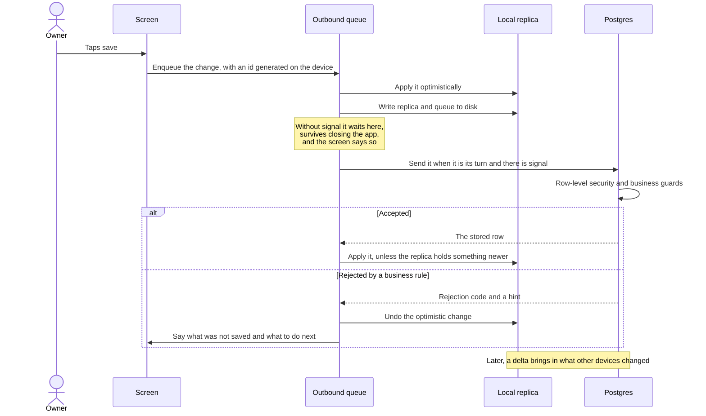
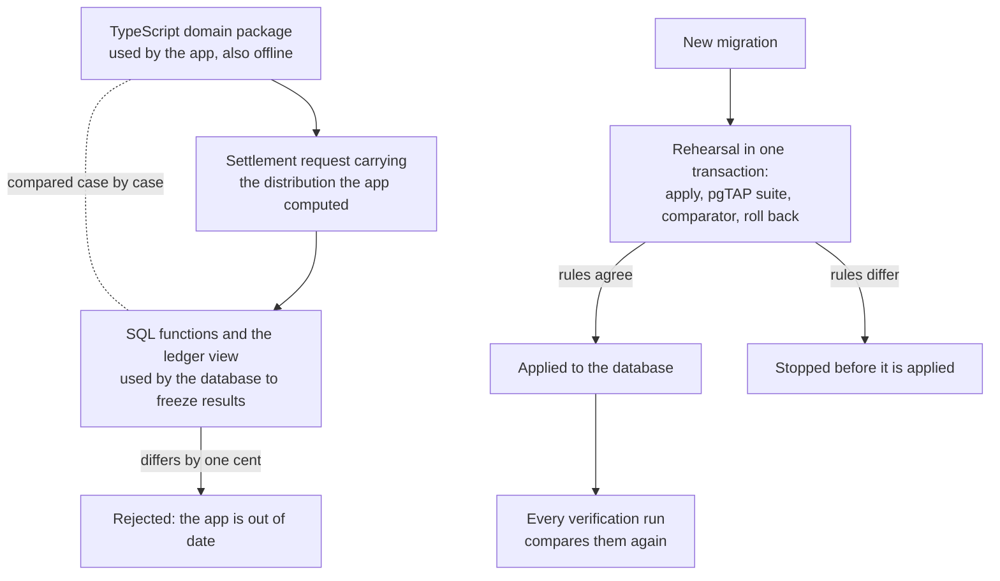

# MAUN

Money and projects for a custom furniture workshop in Argentina.

MAUN is the private application a one-person workshop runs on: the clients who call, each job from the
first visit to the last payment, and where every peso goes once a job is paid. It is used at the
workshop computer and on a phone, in a place with very little signal.

It replaces a single HTML file that kept all of the workshop's money in the browser's local storage.
That file worked without signal, which mattered. It also lived on one computer, disappeared with a
cleared cache, and split profit in ways that did not add up. This repository is what took its place:
the same everyday work, with the data in a real database and a complete copy of it on every device.

## The system

The workshop's money lives in four accounts, called treasuries: the household (HOGAR), the workshop
itself (MAUN), the tithe still owed (DIEZMO) and a savings fund for a future house (COCOS). Every
balance the application shows is a sum over the entries that move money into, out of, or between them.

A job starts as a lead: a call, a visit, a quote, sometimes a deposit collected at the visit. When the
client approves it, the same record becomes an active project with a budget, payments and expenses.
When it is paid, collecting it splits the net profit, meaning what was collected minus what was spent,
in a fixed order: the tithe, the owner's salary, the fixed costs the month has not yet covered, and a
remainder that stays in the workshop. A lead that does not go ahead is closed as lost, and a deposit
kept from it goes through the same cascade. Either settlement can be undone, but only explicitly, never
as a side effect of editing.

Around that core sit a client list, a ledger of every movement, a tithe screen that states the debt in
words instead of as a signed number, and a monthly view of what came in, what went out and how much of
the salary is still uncovered. An agenda puts the dates that follow from the jobs, such as visits, quote
deadlines and estimated deliveries, next to the owner's own notes, and each device can receive a
best-effort reminder in the morning.

The shortest description of the system is what changed from the file it replaced:

|                      | The old HTML file                                     | This system                                                                                     |
| -------------------- | ----------------------------------------------------- | ----------------------------------------------------------------------------------------------- |
| Where the data lives | Local storage of one browser on one computer          | Postgres, with a full copy of the workshop on every signed-in device                            |
| Without signal       | Worked, because nothing was remote                    | Works from the local copy; changes wait in an ordered queue that survives closing the app       |
| Amounts              | Floating-point pesos                                  | Integer cents, end to end                                                                       |
| Profit is split on   | The budget                                            | What was actually collected, minus expenses                                                     |
| The owner's salary   | Added to the household, never taken from the workshop | A transfer from the workshop to the household                                                   |
| A tithe payment      | Reduced the debt without leaving any account          | Leaves a real account                                                                           |
| Past settlements     | Regenerated every time a project was saved            | Frozen when the project is collected or closed as lost                                          |
| Who can open it      | Anyone at that computer                               | A personal account, isolation per workshop in the database, and a fingerprint lock on the phone |

## How a change travels

Every change to the workshop's data takes the same path, with or without signal. The screen never
waits for the network to show the result, and never says something is saved while it is still queued.



Two consequences shape the rest of the code. Nothing leaves the device before it is on disk, so closing
the app in the middle of a save loses nothing. And because the queue sends one change at a time, a
rejection that will never succeed is shown to the user and removed from the queue instead of retried;
retrying it would block everything behind it.

## Decisions that define it

These are the choices that are not the obvious ones. Each paragraph links to the record that argues
for it.

**Each device holds a full replica of its workshop, not a partial cache and not a sync engine.** One
call returns the entire workshop; after that, a delta returns only what changed, requested from a little
before the last cursor so that a transaction that committed late is never skipped. A complete reconcile
runs on sign-in and periodically, unless changes are still waiting in the queue. Ids are generated on
the device as UUIDv7, so a record created offline is complete and can be referenced at once. Deletes are
logical, because a physical delete is invisible to a device that was offline when it happened. Screens
render from the replica and have no loading states of their own: the network only refreshes what is
already on screen. Dedicated sync engines solve partial replication of large datasets for many clients,
and this is one small dataset per workshop. ([0010](docs/adr/0010-sincronizacion-replica-completa.md),
[0013](docs/adr/0013-shell-navegacion-e-inicio.md))

**Money is an integer number of cents everywhere.** Postgres stores `bigint` columns named with a
`_centavos` suffix. TypeScript uses a branded integer type whose operations refuse any result that is
not a safe integer. Floating point was the old file's problem; JavaScript `BigInt` was rejected as well,
because it does not serialize to JSON, cannot be part of a query key, and pays for a range this business
never reaches. Percentages are integer basis points, rounding is half-up with the same integer formula
in both languages, and dividing by one hundred happens once, when an amount is formatted.
([0002](docs/adr/0002-importes-en-centavos.md))

**The business rules exist twice, and a comparator keeps the two identical.** The application needs the
profit split to show the breakdown before a project is collected, also without signal. The database
needs it to freeze the result without trusting a phone's arithmetic. So the cascade, the monthly caps,
the project state machine and the ledger are written once in the pure TypeScript domain package and
again in SQL.



The comparator covers generated edge cases (half-cent rounding, losses, zero caps, amounts near the safe
integer limit) and real sequences of settlements computed exactly as the application computes them.
Because the rehearsal rolls back, a migration that makes the two implementations diverge never reaches
the database. The last line of defense is in production itself: a stale application served from cache
that applies an older rule gets a rejection instead of a wrong frozen distribution.
([0011](docs/adr/0011-dominio-cascada-estados-y-cobro.md))

**A settlement freezes its distribution, and the ledger is a view.** Collecting a project, or closing it
as lost, stores the amount of each step together with everything used to compute it: the date, the
salary and fixed-cost targets, and how much the month had already covered. Database checks require
that the steps add up exactly to the net profit and that a settled project has a complete distribution.
Changing the salary next year does not rewrite last year. The ledger is a view that joins manual
movements with entries derived from payments, expenses and frozen distributions; every entry names the
account it leaves and the account it enters, and a transfer is one row, not two that can drift apart.
Correcting a closed settlement means reopening it, and a reopened project is collected again with its
original date and targets, so fixing an expense never moves a salary into another month.
([0003](docs/adr/0003-distribucion-congelada.md))

Settlements take row locks in a fixed order, so a payment and a settlement arriving at the same instant
are serialized, and tests with real connections prove each side waits for the other. When a settlement
made without signal reaches the database with an outdated view of the month, the database recomputes
the caps with its own figures and freezes that, as long as the application's arithmetic was right for
what it had seen, and the user is told the difference in money. A settlement the database does reject
is kept in a list of notices until the user dismisses it, because something the user believes is done
cannot vanish silently. ([0016](docs/adr/0016-el-cobro-y-el-rechazo-que-encuentra-al-usuario.md))

**Rows are isolated by workshop from the first migration.** The browser talks to the database with a
public key, so row-level security is the only real barrier between one account and another. Every table
of workshop data carries a workshop id that the client can neither send nor change, policies written in
the form the query planner can serve from an index, explicit column-level grants, and no delete grant
for anyone. Composite foreign keys keep every child row inside its parent's workshop. A structural test
fails if any table, including one added later, arrives without all of this. An account receives its
workshop from a trigger in the same transaction that confirms the account, so a confirmed account
without a workshop cannot exist. ([0004](docs/adr/0004-rls-y-aislamiento-por-household.md),
[0012](docs/adr/0012-acceso-sesion-y-cola-de-salida.md))

**The database is developed without Docker.** The development machine does not have it, which rules
out a local database, schema diffing and the stock database test command. Migrations are written by
hand and kept small enough to review line by line. A rehearsal applies pending migrations inside a
transaction against the real project, runs the full pgTAP suite and the comparator, and always rolls
back. The pgTAP suite goes through a runner of its own, which refuses any test file that tries to control
the transaction and checks that the transaction id is the same at the end. A snapshot of the live schema,
generated from the Postgres catalog, is compared against the database on every verification run, which
catches both a forgotten regeneration and a change made outside the repository. Connections verify a
TLS root pinned in the repository. ([0008](docs/adr/0008-migraciones-a-mano-sin-docker.md))

**A phone with poor signal is the primary device.** Pulling down to refresh drains the queue and fetches
the delta; it never reloads the document, because a reload would remount the application and ask for the
fingerprint again. The fingerprint lock is a barrier to use, like a banking app's, not a security
boundary: the persisted session is what grants access, and the database revalidates it on every query.
Only one WebAuthn ceremony runs at a time, since a second request is rejected immediately while another
is pending. Every session screen that waits on the network has a way out, because a request over that
signal may never finish. ([0023](docs/adr/0023-sesion-bloqueo-con-huella-y-passkeys.md),
[0027](docs/adr/0027-tirar-para-actualizar-sincroniza.md),
[0031](docs/adr/0031-ninguna-pantalla-de-sesion-encierra.md),
[0032](docs/adr/0032-una-sola-ceremonia-de-webauthn-por-vez.md))

## Decision records

> [!NOTE]
> The decision records, the working notes inside each package, identifiers in the code and commit
> messages are written in Spanish, the language of the workshop. This README is meant to be enough to
> understand the system without them. Every link in this section leads to a document in Spanish.

The full, numbered index is in [docs/adr](docs/adr/README.md). These are the records that best explain
why the system looks the way it does:

- [0002](docs/adr/0002-importes-en-centavos.md): amounts as integer cents, and why JavaScript `BigInt`
  lost to a branded integer.
- [0003](docs/adr/0003-distribucion-congelada.md): frozen distributions and the ledger as a view, and
  the three accounting bugs of the old file that they remove.
- [0004](docs/adr/0004-rls-y-aislamiento-por-household.md): row-level security on every table, and the
  policy form that actually uses the index.
- [0008](docs/adr/0008-migraciones-a-mano-sin-docker.md): hand-written migrations against the only
  database, rehearsed in a transaction that always rolls back.
- [0009](docs/adr/0009-velocidad.md): the region chosen by measured latency, one round trip to start,
  and the data volumes that would change the design, decided before they are reached.
- [0010](docs/adr/0010-sincronizacion-replica-completa.md): a full replica instead of a sync engine,
  with client-generated ids, logical deletes and an overlapping watermark.
- [0011](docs/adr/0011-dominio-cascada-estados-y-cobro.md): the cascade, caps and state machine in two
  languages that cannot diverge, and which behaviors of the old file were bugs and which were policy.
- [0012](docs/adr/0012-acceso-sesion-y-cola-de-salida.md): password sign-in instead of magic links, a
  session verified without network, and how the outbound queue keeps its order across restarts.
- [0016](docs/adr/0016-el-cobro-y-el-rechazo-que-encuentra-al-usuario.md): collecting a project, where
  the breakdown is the confirmation and a rejection has to reach the user.
- [0017](docs/adr/0017-los-datos-del-sistema-viejo.md): the old data enters once, through a script that
  uses the same front door as the application.
- [0019](docs/adr/0019-seguimiento-el-contacto-es-la-misma-fila.md): a lead is the same row as the
  project it becomes, so the deposit never has to move.
- [0023](docs/adr/0023-sesion-bloqueo-con-huella-y-passkeys.md): the fingerprint lock as a barrier to
  use, not a security boundary.
- [0034](docs/adr/0034-la-agenda-calcula-lo-que-sale-de-los-trabajos.md): the agenda computes what
  follows from each job instead of storing it, so a date has one source and the reminder cannot
  disagree with the screen.
- [0036](docs/adr/0036-avisos-por-dispositivo-fuera-de-la-replica.md): push subscriptions belong to a
  device, not to the workshop, so they stay out of the replica; reminders are best effort.

[Parity with the old system](docs/paridad-con-el-sistema-viejo.md) maps every feature and calculation of
the old file to where it lives now, including what was deliberately left out. The old file itself is
kept in [docs/referencia](docs/referencia/Finanzas_MAUN_v3.html).

## Working in the repository

You need Node and pnpm at the versions declared in the root `package.json`. The Supabase CLI is needed
only for schema work, and it runs through a wrapper in `packages/db` that loads the repository's own
access token. Docker is not used.

```sh
pnpm install
```

Create `apps/web/.env` from `apps/web/.env.example`. Only the project URL and the publishable key reach
the browser, and the build stops if a `VITE_` variable looks like a secret. The credentials of the
end-to-end test account deliberately lack that prefix.

```sh
pnpm dev
pnpm verify
pnpm e2e
```

`pnpm dev` serves the application. `pnpm verify` lints, typechecks, tests and builds the whole workspace,
database suite and comparator included. The repository deliberately has no CI, so this is the gate before
every push. `pnpm e2e` runs Playwright against the production build, because the service worker, and
with it reopening the application without signal, only exists there. The first run needs a browser:

```sh
pnpm --filter @maun/web exec playwright install chromium
```

Boundaries are lint errors, not conventions. Packages depend in one direction: the application uses the
design system, the domain and the database package; the database package may use the domain; the design
system and the domain use nothing from the repository. Inside the application, a module imports only
from the layers below it, and only through each slice's public entry point.

> [!WARNING]
> There is a single Supabase project, and it is production. Database tests, the migration rehearsal and
> the comparator run inside transactions that always roll back, and the test runner enforces it. Seed
> data lives in a workshop of its own. `pnpm verify` needs network access and the database password in
> `supabase/.env`, which git ignores. The secret key never enters the repository or the browser bundle.

<details>
<summary>Changing the database schema</summary>

1. Write a new migration in `supabase/migrations/`. A migration that has been applied is never edited.
2. Rehearse it. This applies every pending migration, runs the pgTAP suite and the comparator, and rolls
   back:

   ```sh
   pnpm --filter @maun/db db:ensayo
   ```

3. Apply it with the Supabase CLI, through the wrapper in `packages/db`. A destructive change to a table
   that already holds data stops here and is discussed first.
4. Regenerate the database types and the schema snapshot, and commit both. Neither is edited by hand:

   ```sh
   pnpm --filter @maun/db gen:types
   pnpm --filter @maun/db db:esquema
   ```

5. Run `pnpm verify`.

A new table arrives with row-level security, its policies, column grants, the metadata trigger, a
workshop id, its indexes and its tests; the structural test rejects it otherwise. A change to a rule in
`packages/domain` ships with the matching SQL migration in the same change.

</details>

<details>
<summary>Spanish terms you will meet in the code</summary>

- `tesoro`: one of the four accounts. `hogar` is the household, `maun` the workshop, `diezmo` the
  tithe owed, `cocos` the savings fund.
- `taller`, and `household` in the schema: a workshop, the unit of isolation.
- `proyecto`: a job, from lead to settlement. `seguimiento` is its follow-up phase, before approval.
- `seña`: a deposit. `pago` is a payment, `gasto` an expense.
- `cascada`: the profit split. `sueldo` is the salary, `costos fijos` the fixed costs, `remanente` what
  remains.
- `cobrar`: to collect a project and settle it. `perdido` is a job closed as lost. `liquidación` is
  either settlement.
- `libro mayor`: the ledger. `movimiento` is a manual entry, `ajuste` a correction.
- `réplica`: the local copy of a workshop. `cola de salida` is the outbound queue.
- `ajustes`: the workshop's settings.
- `agenda`: the calendar. `anotación` is a note the owner writes in it; `derivado` is an event computed
  from a job.
- `aviso`: a notice. On screen it is a toast; `avisos de la agenda` are the morning push reminders.
- `MN001` and the codes after it: business rejections raised by the database.

</details>

## Repository layout

```text
apps/web          the installable web application: screens, local replica, outbound queue
packages/domain   pure business rules: money, the cascade, caps, states, the ledger
packages/db       database client, generated types, replica merging, and database tooling
packages/ui       the design system: tokens and components, importing nothing from the repository
packages/config   shared TypeScript and lint configuration
supabase          hand-written migrations, pgTAP tests, the reminder edge function, the seed, and the schema snapshot
docs/adr          architecture decision records
docs/referencia   the old HTML file, kept as a reference
```

Inside `apps/web`, code is organized in layers, from `app` through `pages`, `features` and `entities`
down to `shared`. Supabase is reached only from `shared/api`, and the design system only from
`shared/ui`.
